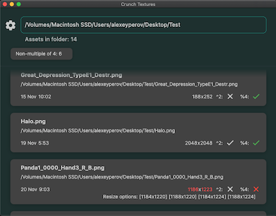

# Check and resize textures to work with Crunch compression


[](https://opensource.org/licenses/MIT)
[](https://GitHub.com/Naereen/StrapDown.js/graphs/commit-activity)

##

With this tool you can scan images (.png, .jpeg, .tga) across selected folders and detect which of them can work with Crunch compression.

It simply checks their dimensions and suggests options for resizing.

Resizing is done via [image package](https://pub.dev/packages/image/example) with 4 options:
- linear interpolation
- cubic interpolation
- nearest interpolation
- or adding transparent pixels around original image

## Usage

At first select the folder to work with:


The tool finds all images there then indicating which are multiple of 4 and which are not



Tapping on any of the images opens the panel where you can choose resize options


## 
PS: if you want to change the theme go to Settings:


## Platforms

Works with MacOS and Windows.

Linux should work too but not tested. 

Just type: 
```bash
flutter create --platforms=linux .
```
to add its module to a project.

## How to build

[MacOS](https://retroportalstudio.medium.com/creating-dmg-file-for-flutter-macos-apps-e448ff1cb0f)

[Windows](https://retroportalstudio.medium.com/creating-exe-executable-file-for-flutter-desktop-apps-windows-ea7c338465e)